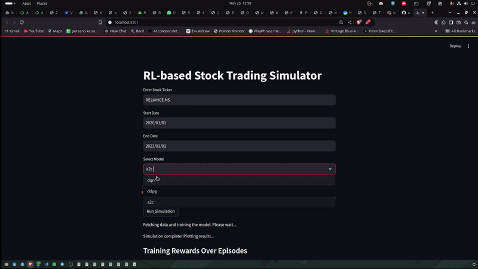

# Reinforcement Learning-based Stock Trading Simulator
This project provides an implementation of a Reinforcement Learning (RL) based stock trading simulator. The simulator uses RL algorithms like DQN (Deep Q-Network), DDPG (Deep Deterministic Policy Gradient), and A2C (Advantage Actor-Critic) to train agents that can trade stocks based on historical data. The simulator allows backtesting of trained agents in a realistic environment to evaluate their performance.

### Streamlit Testing



#### Table of Contents
- Overview
- Installation
- TODO
- RL Methods
    - DQN (Deep Q-Network)
    - DDPG (Deep Deterministic Policy Gradient)
    - A2C (Advantage Actor-Critic)
- Usage
- Setup
- Running the Streamlit App
- Training and Backtesting
- Project Structure
- License


### Overview
This stock trading simulator uses RL algorithms to predict and trade stock prices based on historical data. The key features of the project are:

- Stock Data Fetching: The simulator fetches historical stock data from Yahoo Finance.
- RL Agent Training: Trains an RL agent using different algorithms such as DQN, DDPG, and A2C.
- Backtesting: The trained agent is evaluated on historical stock data to assess its performance.
- Streamlit Interface: A web-based interface to allow users to interact with the simulator, select stocks, algorithms, and date ranges.
- Installation
    - Clone the repository:

```bash
git clone https://github.com/artzuros/trading
cd trading
```

Create a virtual environment (optional but recommended):

```bash
python -m venv venv
source venv/bin/activate  # On Windows, use `venv\Scripts\activate`
```

Install the required dependencies:

```bash
pip install -r requirements.txt
```
Install Streamlit (if not already installed):

```bash
pip install streamlit
```

### TODO
- More RL Methods like PPO
- Option to explore more hyperparameters like GridSearch and RandomSearch
- Merge with `backtesting.py`
- Calculate backtest steps: Dependent on the training data range
# DONE
- ✔️ Consistency with reproducible results: Ensure that models produce consistent results under the same conditions.


## RL Methods
### DQN (Deep Q-Network)
    DQN is an RL algorithm that uses a neural network to approximate the Q-value function. The Q-value function estimates the expected future rewards for each action in a given state. The agent selects actions based on these Q-values and uses an epsilon-greedy strategy to balance exploration and exploitation.

    Key Features:

    Experience Replay: Stores past experiences and samples them to train the agent.
    Target Networks: Periodically updates the target network to stabilize training.

### DDPG (Deep Deterministic Policy Gradient)
    DDPG is an off-policy RL algorithm designed for continuous action spaces, where the actions taken by the agent are continuous (e.g., buying a fractional amount of stock). DDPG uses two neural networks:

    Actor Network: Outputs continuous actions.
    Critic Network: Evaluates the Q-value of the state-action pair.
    Key Features:

    Deterministic Policy: Unlike other policy gradient methods, DDPG uses a deterministic policy to directly output actions.
    Ornstein-Uhlenbeck Noise: Helps with exploration by adding noise to the action outputs.
    Target Networks: Helps stabilize learning by providing a target for the critic.

### A2C (Advantage Actor-Critic)
    A2C is a synchronous variant of the Actor-Critic algorithm. In A2C, the actor network selects actions, and the critic network evaluates the action by estimating the state value. The agent learns by maximizing the advantage function, which measures how much better an action is compared to the average action.

    Key Features:

    Synchronous Updates: Uses multiple agents to update the policy at the same time, ensuring more stable and faster learning.
    Entropy Regularization: Encourages exploration and prevents premature convergence of the policy.


### Usage
#### Setup
Clone the repository:

```bash
git clone https://github.com/artzuros/trading
cd trading
```
Install required dependencies:

```bash
pip install -r requirements.txt
```
Install Streamlit (if not installed):

```bash
pip install streamlit
```
Running the Streamlit App
The project includes a Streamlit-based user interface for easy interaction with the simulator.

To launch the Streamlit app, run the following command:

```bash
streamlit run app.py
```
This will start a local server and open the Streamlit app in your default web browser. You can then:

Enter a stock ticker symbol (e.g., AAPL for Apple).
Choose a date range for the historical stock data (e.g., 2010-01-01 to 2020-01-01).
Select the RL algorithm (DQN, DDPG, or A2C).
Start the simulation and visualize the trading performance.
Training and Backtesting
Training: To train an RL agent, run the training script. For example:

```bash
python train_and_backtest.py --model dqn --ticker AAPL --start_date 2010-01-01 --end_date 2020-01-01
```
This will:

- Fetch historical stock data for the specified ticker and date range.
- Train a DQN agent on the data.
- Save the trained model.
- Backtesting: After training, backtest the agent to evaluate its performance:

```bash
python train_and_backtest.py --backtest --model dqn --ticker AAPL --start_date 2010-01-01 --end_date 2020-01-01
```

This will:

- Use the trained DQN agent to simulate trading on the historical data.
<!-- - Provide performance metrics such as total return, Sharpe ratio, and drawdown. -->

### Project Structure
```bash
trading/
├── app.py                    # Streamlit app for user interaction
├── train_and_backtest.py      # Script to train and backtest RL agents
├── dqn.py                     # Implementation of the DQN agent
├── ddpg.py                    # Implementation of the DDPG agent
├── a2c.py                     # Implementation of the A2C agent
├── env.py                     # Custom trading environment
├── requirements.txt           # Required Python packages
├── results/                   # Contains results performed
├── media/                     # Contains all relevant media
└── README.md                  # Project documentation

app.py: A Streamlit interface for easy interaction with the RL models.

train_and_backtest.py: Main script for training and backtesting the RL agents.

dqn.py, ddpg.py, a2c.py: Implementations of the RL agents using DQN, DDPG, and A2C algorithms respectively.

env.py: Defines the custom stock trading environment used for training the agents.

requirements.txt: List of Python dependencies required for the project.
```

### License
This project is licensed under the MIT License. See the LICENSE file for more details.

Feel free to explore the code, experiment with different RL models, and improve the simulation!
